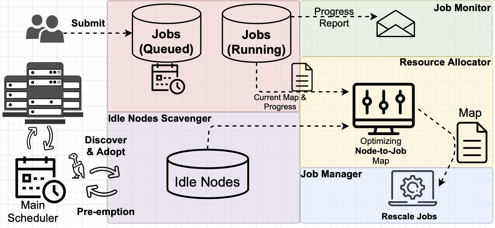

# BFTrainer
This is a temporary repository to host source for paper: BFTrainer: Low-Cost Training of Neural Networks on Unfillable Supercomputer Nodes which is currently under double-blind review. This repo will be moved to our orginization account once review is done.

The BFTrainer's philosophy of design is **zero-cost** to jobs in the main scheduler of the supercomputer. It does mean that BFTrainer is the lowest priority to use resource but it does NOT mean that jobs run by BFTrainer will be slow because BFTrainer **relaxes** resource requirement and optimizes the way to utilize any fragmented resource. Depending on relative demand, jobs submitted to BFTrainer may run slower or faster than submitting it to the main queue/scheduler.

This prototype relies on [Elastic Horovod](https://horovod.readthedocs.io/en/stable/elastic_include.html) which minimizes user code change (only one line of change specific to BFTrainer). However, we realized it also (over)complicate BFTrainer, especially the job monitoring module. We are developping V2 based on pyTorch for better trade-off between user-code change effort and BFTrainer implementation. 

## Main Batch Scheduler 
BFTrainer works with any batch scheduler that has either one of the follow features: 
- Grand SSH access to idle nodes for particular users, e.g., BFTrainer admin/user, the scheduler can revoke (i.e., pre-empt) at any time without heads-up.
- shrink-to-fit, i.e., the scheduler(e.g., PBSPro) allows submitting a request with a range of nodes and later stretch the allocation when needed (i.e., pre-empt) until all nodes are preempted or request timeout.

## User's Code decoration 
We try to minimize code changes, user need to:
- Implement their DNN training using Elastic Horovod, it's oretty straightforward, instructions available [here](https://horovod.readthedocs.io/en/stable/elastic_include.html).
- User only need to add a line of code in ther iterative training loop to report the progress (e.g., samples processed) that they have made from the iteration.

# MILP solver for optimal resource allocation
We provided two implementations of the MILP model:
- [PYTHON-MIP](https://www.python-mip.com) with open source (free) [CBC](https://github.com/coin-or/Cbc) solver.
- [gurobipy](https://www.gurobi.com/documentation/9.1/quickstart_mac/cs_grbpy_the_gurobi_python.html), the Gurobi Python Interface, with [Gurobi](https://www.gurobi.com) solver. Licensed required, one can use free trial or academia license for evaluation purpose.

Based on our preliminary benchmark, Gurobi is much faster than CBC when problem size is big (e.g., dozens of jobs on hundreds of nodes).
Otherwise, the time to solve is very similar between Gurobi and CBC when problem size is small. 

The PYTHON-MIP also supports using Gurobi as solver (license required as well) but slower than gurobipy in most cases especially when problem size is large.
Thus, one can use the free CBC when problem size is small, especailly for relatively small supercomputers. 
Otherwise, Gurobi with the gurobipy based implementation is recommended.
